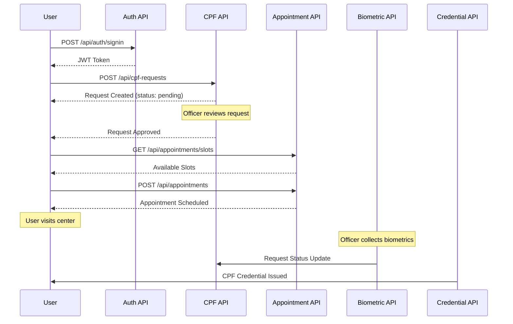
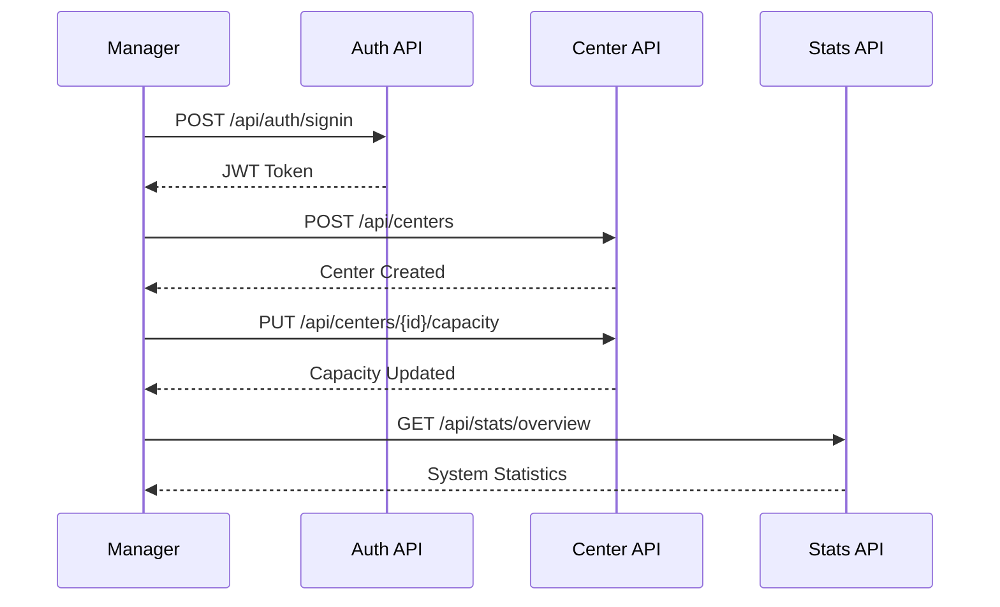

# CPF System API Reference

This document provides a comprehensive overview of the CPF System API endpoints, authentication mechanisms, and usage patterns. It complements the Swagger documentation accessible at `/api-docs` when the server is running.

## API Overview

The CPF System API is organized into several logical groups of endpoints that handle different aspects of the CPF issuance process:

1. **Authentication API**: User registration, login, and token management
2. **CPF Request API**: Submission and management of CPF requests
3. **Appointment API**: Scheduling and management of center appointments
4. **Biometric Data API**: Collection and verification of biometric information
5. **CPF Credential API**: Issuance and verification of CPF credentials
6. **Center API**: Management of service centers
7. **Notification API**: User notification handling
8. **Statistics API**: System-wide statistics and reporting

## Base URL

All API endpoints are relative to the base URL:

```
http://localhost:8080
```

For production environments, the base URL will be the deployed domain.

## Authentication

### Authentication Methods

The API uses JSON Web Tokens (JWT) for authentication. There are several ways to authenticate:

1. **Username/Password**: Traditional username and password login
2. **OAuth Providers**: Google and GitHub OAuth integration
3. **Refresh Token**: Extending sessions using refresh tokens

### Using JWT Tokens

Once authenticated, include the JWT token in the Authorization header for all protected requests:

```
Authorization: Bearer <your-jwt-token>
```

### Token Lifecycle

1. **Obtaining a Token**: Via login or OAuth authentication
2. **Token Expiration**: Tokens expire after the configured timeout (default: 1 hour)
3. **Token Refresh**: Use refresh token to obtain a new access token
4. **Token Revocation**: Logging out invalidates the token

## API Endpoints Reference

### Authentication API

| Endpoint | Method | Description | Authentication |
|----------|--------|-------------|----------------|
| `/api/auth/signup` | POST | Register a new user | None |
| `/api/auth/signin` | POST | Login with username/password | None |
| `/api/auth/signout` | POST | Logout and invalidate token | JWT |
| `/api/auth/refreshtoken` | POST | Refresh an expired token | Refresh Token |
| `/api/auth/google` | GET | Initiate Google OAuth flow | None |
| `/api/auth/google/callback` | GET | Google OAuth callback | None |
| `/api/auth/github` | GET | Initiate GitHub OAuth flow | None |
| `/api/auth/github/callback` | GET | GitHub OAuth callback | None |

### CPF Request API

| Endpoint | Method | Description | Authentication | Role |
|----------|--------|-------------|----------------|------|
| `/api/cpf-requests` | POST | Submit new CPF request | JWT | User |
| `/api/cpf-requests` | GET | List CPF requests | JWT | User/Officer |
| `/api/cpf-requests/user` | GET | Get user's own CPF request | JWT | User |
| `/api/cpf-requests/pending` | GET | Get pending CPF requests | JWT | Officer |
| `/api/cpf-requests/:id` | GET | Get CPF request by ID | JWT | User/Officer |
| `/api/cpf-requests/:id` | DELETE | Delete CPF request | JWT | User |
| `/api/cpf-requests/:id/status` | PUT | Update request status | JWT | Officer |

### Appointment API

| Endpoint | Method | Description | Authentication | Role |
|----------|--------|-------------|----------------|------|
| `/api/appointments/slots` | GET | Get available appointment slots | JWT | User |
| `/api/appointments/user` | GET | Get user's appointments | JWT | User |
| `/api/appointments` | POST | Create new appointment | JWT | Officer |
| `/api/appointments/officer/:officerId` | GET | Get officer's appointments | JWT | Officer |
| `/api/appointments/:id/status` | PUT | Update appointment status | JWT | Officer |
| `/api/appointments/:id/reschedule` | PUT | Reschedule appointment | JWT | User |
| `/api/appointments/:id/checkin` | PUT | Check in for appointment | JWT | Officer |
| `/api/appointments/:id/complete` | PUT | Mark appointment as completed | JWT | Officer |

### Biometric Data API

| Endpoint | Method | Description | Authentication | Role |
|----------|--------|-------------|----------------|------|
| `/api/biometric-data` | POST | Submit biometric data | JWT | Officer |
| `/api/biometric-data/:userId` | GET | Get user's biometric data | JWT | Officer |
| `/api/biometric-data/:id` | PUT | Update biometric data | JWT | Officer |
| `/api/biometric-data/:id/verify` | POST | Verify biometric data | JWT | Officer |
| `/api/biometric-data/:id/quality` | GET | Check biometric data quality | JWT | Officer |

### CPF Credential API

| Endpoint | Method | Description | Authentication | Role |
|----------|--------|-------------|----------------|------|
| `/api/cpf-credentials` | POST | Issue new CPF credential | JWT | Officer |
| `/api/cpf-credentials/:userId` | GET | Get user's CPF credential | JWT | User/Officer |
| `/api/cpf-credentials/verify/:id` | GET | Verify CPF credential | None | Public |
| `/api/cpf-credentials/:id/revoke` | PUT | Revoke CPF credential | JWT | Officer |
| `/api/cpf-credentials/stats` | GET | Get credential statistics | JWT | Officer |

### Center API

| Endpoint | Method | Description | Authentication | Role |
|----------|--------|-------------|----------------|------|
| `/api/centers` | GET | List all centers | JWT | Any |
| `/api/centers` | POST | Create new center | JWT | Manager |
| `/api/centers/:id` | GET | Get center details | JWT | Any |
| `/api/centers/:id` | PUT | Update center | JWT | Manager |
| `/api/centers/:id` | DELETE | Delete center | JWT | Manager |
| `/api/centers/:id/capacity` | GET | Get center capacity | JWT | Any |
| `/api/centers/:id/officers` | GET | Get center officers | JWT | Manager |
| `/api/centers/:id/statistics` | GET | Get center statistics | JWT | Manager |

### Notification API

| Endpoint | Method | Description | Authentication | Role |
|----------|--------|-------------|----------------|------|
| `/api/notifications` | POST | Send notification | JWT | Officer |
| `/api/notifications` | GET | Get user's notifications | JWT | User |
| `/api/notifications/:id/read` | PUT | Mark notification as read | JWT | User |
| `/api/notifications/read-all` | PUT | Mark all notifications as read | JWT | User |
| `/api/notifications/unread-count` | GET | Get unread notification count | JWT | User |

### Statistics API

| Endpoint | Method | Description | Authentication | Role |
|----------|--------|-------------|----------------|------|
| `/api/stats/requests` | GET | Get CPF request statistics | JWT | Manager |
| `/api/stats/appointments` | GET | Get appointment statistics | JWT | Manager |
| `/api/stats/credentials` | GET | Get credential statistics | JWT | Manager |
| `/api/stats/biometrics` | GET | Get biometric statistics | JWT | Manager |
| `/api/stats/centers` | GET | Get center statistics | JWT | Manager |
| `/api/stats/overview` | GET | Get system overview | JWT | Manager |

## Common Request/Response Patterns

### Pagination

Many list endpoints support pagination with the following query parameters:

```
?page=1&limit=10
```

Paginated responses include:

```json
{
  "items": [...],
  "totalPages": 5,
  "currentPage": 1,
  "totalItems": 42
}
```

### Filtering

List endpoints often support filtering with query parameters:

```
?status=pending&startDate=2023-01-01&endDate=2023-12-31
```

### Sorting

Some endpoints support sorting:

```
?sortBy=createdAt&order=desc
```

### Error Responses

Error responses follow this structure:

```json
{
  "message": "Error message explaining what went wrong",
  "error": {
    "code": "ERROR_CODE",
    "details": {}
  }
}
```

Common HTTP status codes:

- **200**: Success
- **201**: Created
- **400**: Bad Request (client error)
- **401**: Unauthorized (authentication required)
- **403**: Forbidden (insufficient permissions)
- **404**: Not Found
- **409**: Conflict
- **422**: Unprocessable Entity (validation failed)
- **429**: Too Many Requests (rate limiting)
- **500**: Internal Server Error

## API Integration Examples

### Example: Complete CPF Request Flow



### Example: Administrative Flow



## Rate Limiting

The API implements rate limiting to prevent abuse:

- Authentication endpoints: 5 requests per 15 minutes per IP
- Other endpoints: 100 requests per minute per user

When rate limit is exceeded, the response will have status code 429 with a message indicating when the limit will reset.

## Webhooks

The system supports webhooks for certain events:

- CPF request status changes
- Appointment status changes
- Credential issuance or revocation

To register a webhook, use:

```
POST /api/webhooks
```

with your endpoint URL and the events you want to subscribe to.

## Best Practices

1. **Always validate tokens**: Ensure your JWT token is valid before making requests
2. **Handle token expiration**: Be prepared to refresh tokens when they expire
3. **Implement proper error handling**: Account for various HTTP status codes
4. **Use pagination**: For list endpoints, always use pagination to limit response size
5. **Rate limiting awareness**: Implement backoff strategies for rate limit errors

## API Versioning

The current API version is v1. When new versions are released, they will be available at:

```
/api/v2/...
```

The current version will be maintained for backward compatibility according to the deprecation policy.

## API Health Check

To check if the API is available:

```
GET /api/health
```

This endpoint returns a simple status message and does not require authentication.

## Further Documentation

For more detailed information on specific endpoints, including request and response schemas, please refer to the Swagger documentation available at `/api-docs`. 