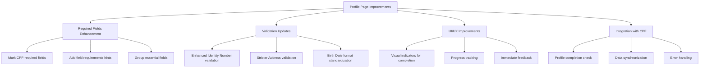

# Profile Page and CPF Integration Enhancement Plan

## Overview

This document outlines the plan to improve the profile page functionality and its integration with CPF requests, ensuring a more professional and user-friendly experience.

## Current Analysis

### Profile Implementation

- Uses reactive form with comprehensive validation
- Has sections for personal and professional information
- Includes profile photo upload capability
- Handles password changes and session management

### CPF Request Requirements

Essential fields needed:

- Identity Number (8-12 digits)
- Birth Date (must be 18+ years old)
- Address

### Current Issues

- Profile saving works but needs better validation for CPF-required fields
- No clear indication which fields are required for CPF requests
- No direct link between profile completion and CPF request capability

## Implementation Plan

### 1. Required Fields Enhancement

- Add visual indicators (asterisk \*) for CPF-required fields
- Group essential fields in a dedicated "Official Information" section
- Add tooltips explaining why certain fields are required

### 2. Validation Updates

- Enhance Identity Number validation:
  - Immediate format checking
  - Real-time uniqueness validation
  - Clear error messages
- Add address validation:
  - Required format
  - Minimum length requirements
  - Postal code validation
- Standardize birth date format and validation

### 3. UI/UX Improvements

- Add a profile completion progress bar
- Show clear validation status for each field
- Add immediate feedback on field completion
- Implement a "CPF Requirements" status panel

### 4. Integration with CPF

- Add a profile completion check before allowing CPF requests
- Implement automatic data synchronization between profile and CPF request
- Add clear error messages when profile data is insufficient
- Provide direct links to complete missing information

### 5. Technical Implementation

- Update form validation rules
- Enhance error handling
- Improve data persistence
- Add real-time validation feedback

## Next Steps

1. Implement UI changes for required fields
2. Update validation logic
3. Add progress tracking
4. Enhance CPF integration
5. Test and validate changes
